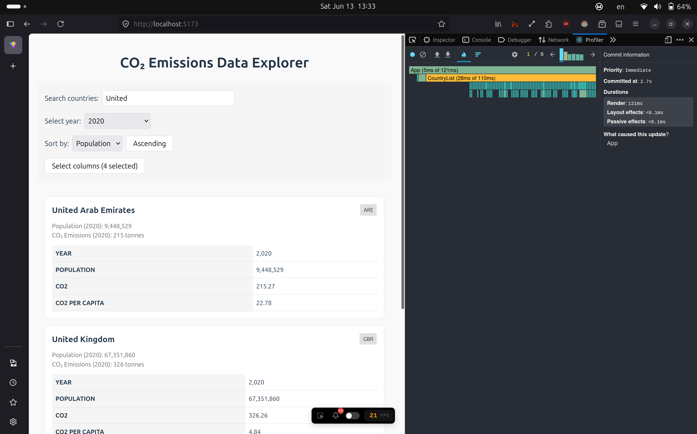
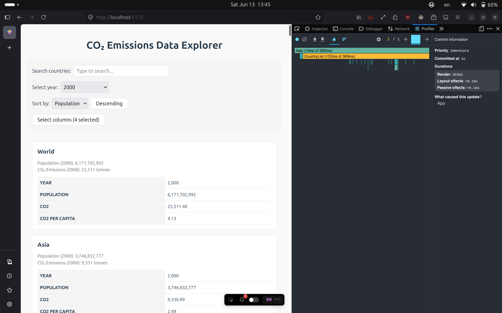
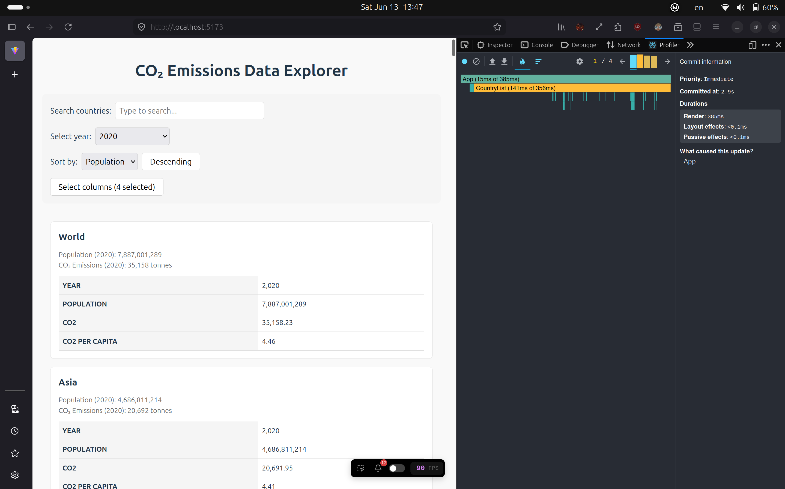
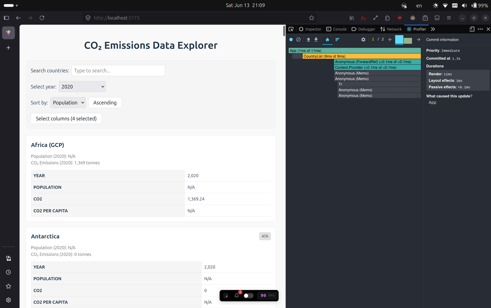
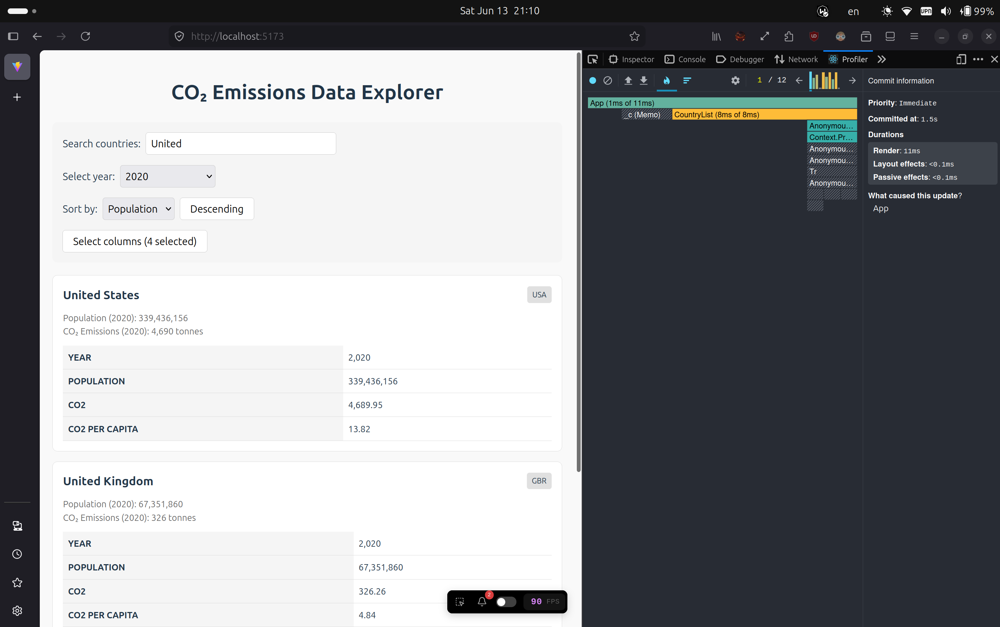
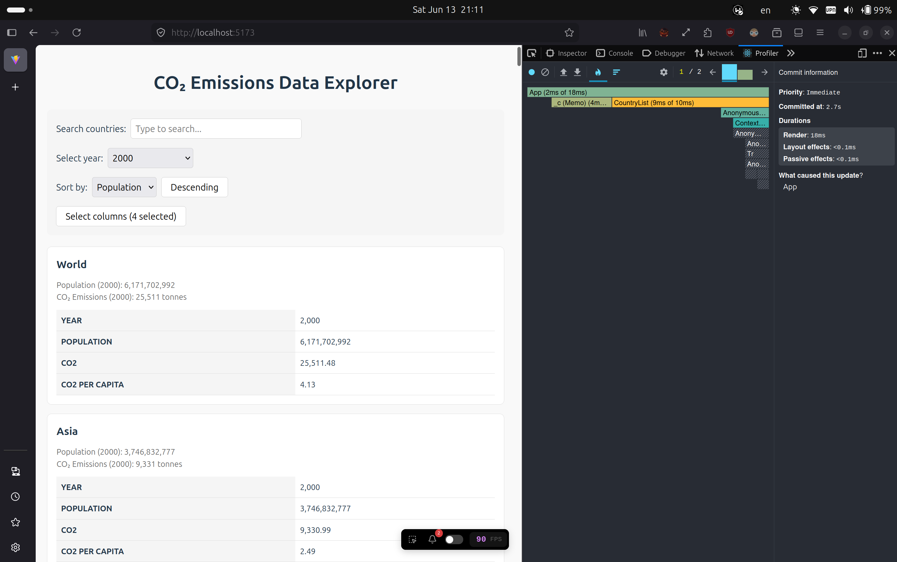
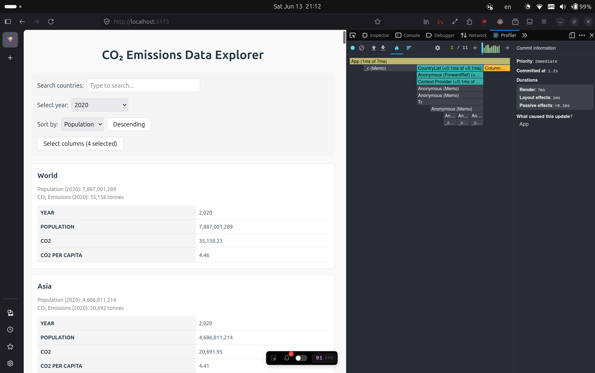

# Performance Optimization Report

## Baseline Measurements

### Interaction A: Sort countries

- **Commit duration**: 2.8 s
- **Render duration**: 359 ms
- **Screenshot**: 

### Interaction B: Search countries

- **Commit duration**: 2.7 s
- **Render duration**: 121 ms
- **Screenshot**: 

### Interaction C: Change year

- **Commit duration**: 4 s
- **Render duration**: 393 ms
- **Screenshot**: 

### Interaction D: Toggle column

- **Commit duration**: 2.9 s
- **Render duration**: 385 ms
- **Screenshot**: 

## Optimized Measurements

### Interaction A: Sort countries

- **Commit duration**: 1.3 s
- **Render duration**: 11 ms
- **Screenshot**: 

### Interaction B: Search countries

- **Commit duration**: 1.5 s
- **Render duration**: 11 ms
- **Screenshot**: 

### Interaction C: Change year

- **Commit duration**: 2.7 s
- **Render duration**: 18 ms
- **Screenshot**: 

### Interaction D: Toggle column

- **Commit duration**: 1.2 s
- **Render duration**: 7 ms
- **Screenshot**: 

## Summary of Improvements

| Interaction      | Baseline (ms) | Optimized (ms) | Improvement |
| ---------------- | ------------- | -------------- | ----------- |
| Sort countries   | 359           | 11             | 96.94%      |
| Search countries | 121           | 11             | 90.91%      |
| Change year      | 393           | 18             | 95.42%      |
| Toggle column    | 385           | 7              | 98.18%      |
| **Average**      | 314.5         | 11.75          | 96.26%      |
